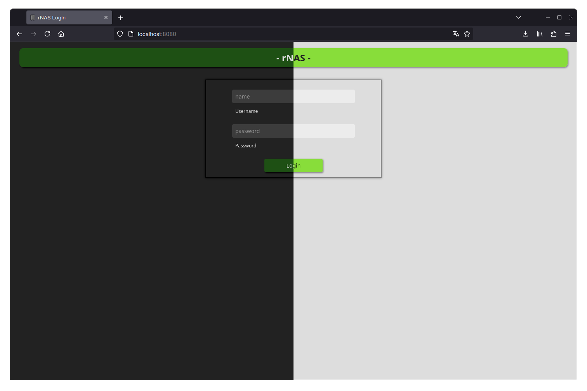
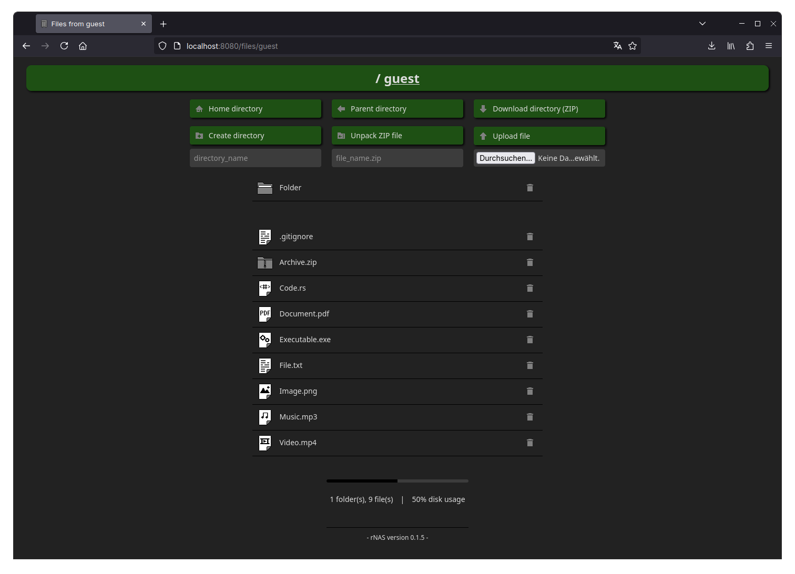

# rNAS





*-- German Version --*

## Generelle Informationen

rNAS ist ein extrem simpler, leichtgewichtiger NAS-Server, der sich für den Einsatz in einer privaten Umgebung eignet. 
Das Ziel der zugehörigen Weboberfläche ist, das NAS ohne betriebssystemspezifische Integrationen von möglichst jedem 
internetfähigen Gerät erreichen zu können.

Zusätzlich soll der Code besonders kurz und übersichtlich gehalten werden, damit jederzeit nachvollziehbar bleibt, 
was an welcher Stelle mit den verarbeiteten Daten passiert, sowie, um eine einfache Erweiterbarkeit zu gewährleisten. 

Der Quellcode von rNAS ist in [Rust](https://www.rust-lang.org/) geschrieben und befindet sich unter `src/main.rs`. 
Als Webserver wird [Rocket](https://rocket.rs/) verwendet. Ein Großteil der zugehörigen Webseiten befindet sich in 
Form von HTML-Dateien mit Inline-CSS unter `static/`. Zusätzlich wird für die Einrichtung des Servers das Python-Script 
`add_users.py` mitgeliefert und für sonstige Konfigurationen kommen TOML-Dateien zum Einsatz.

Für den Server eignet sich jede Hardware, auf der Linux installiert und der Rust-Compiler ausgeführt werden kann. 
Eine Liste der kompatiblen Architekturen ist [hier](https://doc.rust-lang.org/nightly/rustc/platform-support.html) zu 
finden.

Wie beim Vorgänger, [Python-RaspiNAS](https://github.com/nitrescov/Python-RaspiNAS), gibt es für das Projekt keinen 
festen Update- oder Release-Zyklus. Allerdings freue ich mich jederzeit über Verbesserungsvorschläge, sonstige 
Anregungen oder Kritik.

## Voraussetzungen

- Betriebssystem: Linux, da aktuell folgende Tools vorausgesetzt werden: `zip`, `unzip`, `df`
- Rust-Toolchain: siehe [Installationsanleitung](https://www.rust-lang.org/tools/install) (wird für die Kompilierung 
  der Binärdatei benötigt, eine vorkompilierte Version für die x86_64-Architektur ist unter dem jeweils aktuellen 
  Release zu finden)

## Kompilierung

Ist die Rust-Toolchain installiert, kann man die Server-Binärdatei mit folgendem Befehl im Hauptverzeichnis `rNAS/` 
kompilieren (die Angabe der Ziel-Architektur kann ausgelassen werden, wenn der Befehl auf dem Zielsystem ausgeführt 
wird):

```shell
cargo build --release --target x86_64-unknown-linux-gnu
```

## Einrichtung

### 1. Vorbereitung:

Die Ordnerstruktur für den Server und die zugehörigen Daten muss wie folgt aussehen:

```
rNAS/
├── icons/
│   ├── favicon.ico
│   ├── folder_32x32.png
│   └── ...
├── static/
│   ├── de_home.html
│   └── ...
├── tls/
│   ├── rnas.crt
│   └── rnas.key
│
├── (nutzername/)
│   └── (...)
├── (tmp/)
│   └── (...)
│
├── config.toml
├── Rocket.toml
├── rnas (kompilierte Datei)
└── users.csv
```

Der `tmp/`-Ordner und die Nutzerverzeichnisse können auch an einem anderen Ort gespeichert werden. Dieser muss dann 
entsprechend in der Datei config.toml unter `storage_path` hinterlegt werden.

```
storage_path/
├── nutzername/
│   └── ...
└── tmp/
    └── ...
```

### 2. Erstellen und Löschen von Nutzern:

- Als Beispiel wird der Nutzer `guest` mit dem Passwort `123` mitgeliefert.
- Zum Anlegen von Nutzern kann die Datei `add_users.py` ohne Parameter mit Python ausgeführt werden.
- Um einen Nutzer vollständig zu löschen, muss dessen Ordner sowie die Zeile mit seinem Namen und dem zugehörigen 
  Hash-Wert aus der Datei `users.csv` entfernt werden. (**Achtung:** Die Datei sollte danach weiterhin einen 
  Zeilenumbruch am Ende besitzen.)

### 3. Einrichtung des Servers:

Die Konfiguration und Personalisierung des Servers erfolgt in den Dateien `config.toml` und `Rocket.toml`. Er ist aber 
auch mit den Standardeinstellungen lauffähig.

- `config.toml`:

| Parameter         | Wert (Erklärung)                                                                                                                                               |
|-------------------|----------------------------------------------------------------------------------------------------------------------------------------------------------------|
| language          | Einstellung der Sprache (`de` oder `en`)                                                                                                                       |
| owner             | Servername (z.B. Name des Besitzers)                                                                                                                           |
| storage_path      | Speicherpfad der Nutzerverzeichnisse und des `tmp/`-Ordners                                                                                                    |
| background        | RGB-Wert für die allgemeine Hintergrundfarbe (die Standardwerte sorgen für ein dunkles Erscheinungsbild, `config_light.toml` liefert die Werte für ein helles) |
| foreground        | RGB-Wert für die Textfarbe                                                                                                                                     |
| accent_background | RGB-Wert für die Akzentfarbe                                                                                                                                   |
| accent_foreground | RGB-Wert für die Textfarbe auf akzentuierten Flächen                                                                                                           |
| shadows           | RGB-Wert für die Schattenfarbe                                                                                                                                 |
| errors            | RGB-Wert für Fehlermeldungen                                                                                                                                   |
| input             | RGB-Wert für die Hervorhebung von Eingabefeldern                                                                                                               |
| clean_tmp_files   | Intervall zur Bereinigung des `tmp/`-Ordners (in Sekunden, 86400 = 24 Stunden)                                                                                 |
| whitelist         | Erlaubter Zeichensatz für Ordner- und Dateinamen                                                                                                               |
| name_length       | Maximale Länge von Ordner- und Dateinamen                                                                                                                      |

- `Rocket.toml` ([mehr Informationen](https://rocket.rs/v0.5-rc/guide/configuration/)):

| Parameter      | Wert (Erklärung)                                                                                                                                                                                                   |
|----------------|--------------------------------------------------------------------------------------------------------------------------------------------------------------------------------------------------------------------|
| port           | Port für die HTTPS-Kommunikation (normalerweise 443, allerdings kann der Server dann nur mit root-Rechten ausgeführt werden)                                                                                       |
| secret_key     | Schlüssel für die Sicherung des Anmelde-Cookies (**darf nicht auf dem Standardwert belassen werden!**)                                                                                                             |
| default.limits | Maximale Größe von ausgetauschten Daten (siehe [Dokumentation](https://api.rocket.rs/v0.5-rc/rocket/data/struct.Limits.html#built-in-limits), SI-Einheiten zur Basis 10 (z.B. 32kB) oder zur Basis 2 (z.B. 32KiB)) |
| certs          | Pfad der SSL-Zertifikatsdatei                                                                                                                                                                                      |
| key            | Pfad der SSL-Schlüsseldatei                                                                                                                                                                                        |
| address        | IP-Adresse, von der Anfragen empfangen werden (`0.0.0.0` - alle, `127.0.0.1` - nur lokaler Rechner)                                                                                                                |

### 4. Erzeugen eines neuen Sicherheitsschlüssels (secret_key):

Der Schlüssel kann mit folgendem Befehl generiert werden:

```shell
openssl rand -base64 32
```

### 5. Erstellen eines selbst-signierten SSL-Zertifikates (mehr Details bei [Baeldung](https://www.baeldung.com/openssl-self-signed-cert)):

Zunächst muss OpenSSL installiert sein (`sudo apt install openssl`/`sudo pacman -S openssl`). 

Die nun folgenden Befehle sollten im `tls/`-Verzeichnis ausgeführt werden. Alternativ können sie angepasst werden, um das 
Zertifikat mit anderen Voreinstellungen und/oder an einem anderen Ort zu speichern.

- Die Schlüsseldatei generieren:

```shell
openssl genrsa -out rnas.key 2048
```

- Eine "Certificate Signing Request" erstellen:

```shell
openssl req -key rnas.key -new -out rnas.csr
```

- Das Zertifikat erzeugen (Die Gültigkeitsdauer des Zertifikates in Tagen kann nach Belieben verändert werden.):

```shell
openssl x509 -signkey rnas.key -in rnas.csr -req -days 365 -out rnas.crt
``` 

### 6. Starten und Beenden des Servers:

- Ausführen der kompilierten Datei `./rnas`
- Beenden mit `STRG + C`, Rocket sorgt für ein geregeltes Schließen des Webservers

> Hinweis:<br>
> Das Programm sollte derzeit ausschließlich auf einem nicht öffentlich erreichbaren Heimserver genutzt werden. Die 
> Anmeldedaten werden mittels SHA384 gehasht und über einen gesicherten Cookie übertragen. Auch die Verbindung wird 
> durch SSL/TLS abgesichert, aber es existiert aktuell keinerlei Schutz gegen spezifische Angriffe auf den Server 
> (z.B. Brute-Force-Attacken).

---

*-- English Version --*

## General information

rNAS is an extremely simple, lightweight NAS server suitable for use in a private environment. The goal of the included 
web interface is to be able to access the NAS from any Internet-enabled device without system-specific integrations.

In addition, the code should be kept particularly short and clear, so that it is always possible to understand what 
happens at which point with the processed data, as well as to ensure easy extensibility.

The source code of rNAS is written in [Rust](https://www.rust-lang.org/) and can be found under `src/main.rs`.
The web server used is [Rocket](https://rocket.rs/). A large part of the associated web pages are stored as HTML files 
with inline CSS in the `static/` directory. Additionally, the Python script `add_users.py` is provided to help with the 
setup of the server and TOML files are used for other configuration options.

Any hardware that can run Linux as well as the Rust compiler is suitable for the rNAS server. A list of compatible 
architectures can be found [here](https://doc.rust-lang.org/nightly/rustc/platform-support.html).

As with its predecessor, [Python-RaspiNAS](https://github.com/nitrescov/Python-RaspiNAS), there is no fixed update or 
release cycle for the project. However, I am always happy to receive suggestions for improvements, feature requests or 
criticism.

## Requirements

- Operating System: Linux, since currently the following tools are required: `zip`, `unzip`, `df`
- Rust Toolchain: see the [Installation Guide](https://www.rust-lang.org/tools/install) (is necessary to compile the
  rNAS binary, but a precompiled version for the x86_64 architecture can be found under the current release)

## Compile

After installing the Rust toolchain, the server binary can be compiled in the main directory `rNAS/` as follows
(the target architecture can be omitted, if the command is executed on the target system):

```shell
cargo build --release --target x86_64-unknown-linux-gnu
```

## Setup

### 1. Preparation:

The directory structure for the server and the associated data must look like this:

```
rNAS/
├── icons/
│   ├── favicon.ico
│   ├── folder_32x32.png
│   └── ...
├── static/
│   ├── en_home.html
│   └── ...
├── tls/
│   ├── rnas.crt
│   └── rnas.key
│
├── (username/)
│   └── (...)
├── (tmp/)
│   └── (...)
│
├── config.toml
├── Rocket.toml
├── rnas (compiled binary)
└── users.csv
```

The `tmp/` folder and user directories can be stored at a different path. This must be set accordingly in the config.toml 
file under `storage_path`.

```
storage_path/
├── username/
│   └── ...
└── tmp/
    └── ...
```

### 2. Create and delete users:

- As an example, the user `guest` with his password `123` is already created.
- To create new users, a Python interpreter can execute the script `add_users.py` without any parameters.
- To completely remove a user, his folder as well as the line containing his name and the associated hash value in the
  `users.csv` file must be deleted. (**Attention:** The file should still have a newline at its end.)

### 3. Server setup:

For configuration and personalization of the server the files `config.toml` und `Rocket.toml` are provided. However, it 
should also run with the default settings.

- `config.toml`:

| parameter         | value (explanation)                                                                                                                               |
|-------------------|---------------------------------------------------------------------------------------------------------------------------------------------------|
| language          | Language configuration (`de` or `en`)                                                                                                             |
| owner             | Server name (e.g. name of the owner)                                                                                                              |
| storage_path      | Path to store the user directories and the `tmp/` folder                                                                                          |
| background        | RGB value for the general background color (the default values ensure a dark appearance, `config_light.toml` provides the values for a light one) |
| foreground        | RGB value for the text color                                                                                                                      |
| accent_background | RGB value for the accent color                                                                                                                    |
| accent_foreground | RGB value for the text color on accentuated areas                                                                                                 |
| shadows           | RGB value for the shadows                                                                                                                         |
| errors            | RGB value for error messages                                                                                                                      |
| input             | RGB value for the highlighting of input fields                                                                                                    |
| clean_tmp_files   | Interval for cleaning up the `tmp/` folder (in seconds, 86400 = 24 hours)                                                                         |
| whitelist         | Allowed characters for directory and file names                                                                                                   |
| name_length       | Maximum length of directory and file names                                                                                                        |

- `Rocket.toml` ([more information](https://rocket.rs/v0.5-rc/guide/configuration/)):

| parameter      | value (explanation)                                                                                                                                                                                       |
|----------------|-----------------------------------------------------------------------------------------------------------------------------------------------------------------------------------------------------------|
| port           | Port for the HTTPS communication (usually 443, but then the server must be run as root)                                                                                                                   |
| secret_key     | Key to secure the login cookie (**must not be left at the default value!**)                                                                                                                               |
| default.limits | Maximum size of exchanged data (see the [documentation](https://api.rocket.rs/v0.5-rc/rocket/data/struct.Limits.html#built-in-limits), SI units to the base 10 (e.g. 32kB) or to the base 2 (e.g. 32KiB)) |
| certs          | Path of the SSL certificate file                                                                                                                                                                          |
| key            | Path of the SSL key file                                                                                                                                                                                  |
| address        | IP address from which requests are received (`0.0.0.0` - all, `127.0.0.1` - only local machine)                                                                                                           |

### 4. Generate a new secret key:

The key can be generated as follows:

```shell
openssl rand -base64 32
```

### 5. Create a self-signed SSL certificate (more details at [Baeldung](https://www.baeldung.com/openssl-self-signed-cert)):

First, OpenSSL needs to be installed (`sudo apt install openssl`/`sudo pacman -S openssl`).

The following commands should be executed in the `tls/` directory. Alternatively, they can be customized to save the 
certificate with different preferences and/or in a different location.

- Generate the key file:

```shell
openssl genrsa -out rnas.key 2048
```

- Create a "certificate signing request":

```shell
openssl req -key rnas.key -new -out rnas.csr
```

- Generate the certificate (The validity of the certificate in days can be changed at will.):

```shell
openssl x509 -signkey rnas.key -in rnas.csr -req -days 365 -out rnas.crt
``` 

### 6. Start and terminate the server:

- Execute the compiled binary `./rnas`
- Stop it with `CTRL + C`, Rocket takes care of a controlled webserver shutdown

> Note:<br>
> The program should currently only be used on a home server that is not publicly accessible. The login data is hashed 
> using SHA384 and transferred via a secured cookie. The connection is also secured via SSL/TLS, but there is currently 
> no protection against specific attacks targeting the server (e.g. brute force attacks).
